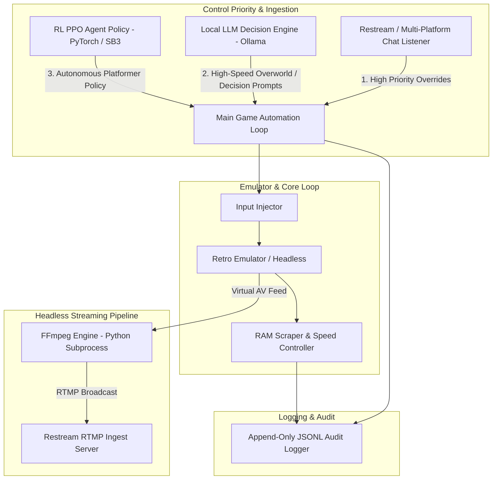

# Architecture & Design Specifications

## Overview
This system is an end-to-end local emulator AI & RL gaming pipeline featuring:
1. **Turn-Based AI Gaming Loop**: RAM state scraping, speed-toggle control, local Ollama LLM decision engine with comedic persona, multi-platform Restream unified chat override, and FFmpeg headless streaming.
2. **Custom PyTorch PPO Platformer Pipeline**: Custom Gymnasium wrapper, PyTorch Actor-Critic PPO architecture, strict reward engineering, checkpointing, and evaluation.
3. **Stable-Baselines3 NES / Castlevania Pipeline**: Gymnasium-compatible environment wrapper around headless retro emulator, reward shaping, Stable-Baselines3 PPO training loop with metrics logging and auto-resume.

## System Architecture Diagram

## Seam & Module Boundaries
- **RAM Scraper & Speed Controller (`emulator/ram_scraper.py`)**: Deep module exposing `get_state()` and `set_speed_mode(mode)`.
- **LLM Player (`ai/llm_player.py`)**: Deep module exposing `get_action(ram_state, persona_prompt)`.
- **Restream Chat Aggregator (`chat/chat_listener.py`)**: Thread-safe command queue exposing `get_next_command()` and `has_commands()`.
- **FFmpeg Streamer (`scripts/stream_gameplay.py`)**: Subprocess wrapper for headless RTMP push to Restream endpoints.
- **PyTorch PPO Engine (`agent/`)**: Clean separation between `env.py`, `model.py`, `rewards.py`, and `scripts/train_agent.py`.
- **Stable-Baselines3 NES Engine (`env/`, `agent/`)**: Gymnasium integration in `retro_env.py`, reward shaping in `rewards.py`, SB3 trainer in `agent/train.py`, runner in `scripts/run_training.py`.
